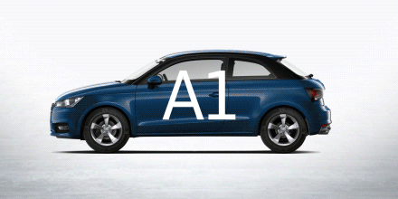

# Car-Classification

**Goal**: Building a vehicle recognition predictive model using machine learning models (traditional and deep learning), and the goal of that model is to classify a car’s make and model based on an input image.

**Raw data source**: https://www.kaggle.com/jessicali9530/stanford-cars-dataset

**Author: Albion Krasniqi**

**Article - Vehicle Classification:** https://medium.com/@albionkrasniqi22_80133/vehicle-classification-742403117f43



**Project structure**
```
├── LICENSE
├── README.md          <- The top-level README for developers using this project.
├── data
│   └── raw              <- The link to the original data
│   └── names            <- csv file with all the names of car classes
│   └── training_labels  <- csv file which contains the information about the car in the training set
│   └── testing_labels   <- csv file which contains the information about the car in the testing set
│
│
├── notebooks          <- Jupyter notebooks. Naming convention is a number (for ordering),
│    └── data pre-processing         
│    └── traditional methods                    
│    └── deep learning methods
│
├── The combined notebook    <- this notebook has everything complied in one place
│
└── requirements.txt   <- The requirements file for reproducing the analysis environment, e.g.
                          generated with `pip freeze > requirements.txt`
```                          
